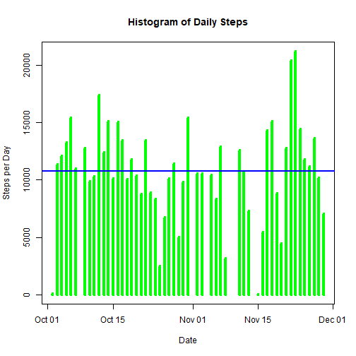
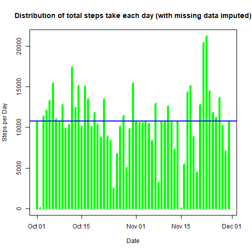

## Reproducible Research Coursera Project One

#### Robert P Jacobs

#### 11 January 2018


#### 1. Code for reading in the dataset and/or processing the data

Check to see if the '/data' directory exists


```r
if (!file.exists("./data")) { 
        dir.create("./data")
} 
```

Check to see if the zip file exists which means file was previously downloaded


```r
if (!file.exists("./data/Dataset.zip")) {
        fileUrl <- "https://d396qusza40orc.cloudfront.net/repdata%2Fdata%2Factivity.zip"
        download.file(fileUrl, destfile = "./data/Dataset.zip", method = "libcurl")
}
```

Unzip if not previously  unzipped


```r
sourcefile <- "./data/activity.csv"
if (!file.exists(sourcefile)) {
        # Unzip the downloaded files
        unzip(zipfile="./data/Dataset.zip",exdir="./data")
}
```

Load the data by reading the CSV file


```r
activitydata <- read.csv(sourcefile)
```

Process/transform the data for analysis


```r
activitydata$date <- as.Date(activitydata$date,"%Y-%m-%d")
transformdata <- subset(activitydata, !is.na(activitydata$steps))
```

#### 2. Histogram of the total number of steps taken each day

Calculate the total number of steps taken per day


```r
totalstepsperday <- aggregate(steps ~ date,
                              data = transformdata,
                              sum,
                              na.rm = TRUE)
```

Make a histogram of the total number of steps taken each day (also show mean as red line and median as blue line)


```r
plot(totalstepsperday$date, 
     totalstepsperday$steps, 
     type = "h", 
     main = "Histogram of Daily Steps", 
     xlab = "Date", 
     ylab = "Steps per Day", 
     col = "green", 
     lwd  = 4)
abline(h = mean(totalstepsperday$steps, na.rm=TRUE), col="red", lwd=2)
abline(h = median(totalstepsperday$steps, na.rm=TRUE), col="blue", lwd=2)
```



#### 3. Mean and median number of steps taken each day

Calculate the mean number of steps taken each day


```r
paste("Mean Steps per Day (indicated by red on the histogram) =", mean(totalstepsperday$steps, na.rm = TRUE))
```

```
## [1] "Mean Steps per Day (indicated by red on the histogram) = 10766.1886792453"
```

Calculate the median number of steps taken each day


```r
paste("Median Steps per Day (indicated by red on the histogram) =", median(totalstepsperday$steps, na.rm = TRUE))
```

```
## [1] "Median Steps per Day (indicated by red on the histogram) = 10765"
```

#### 4. Time series plot of the average number of steps taken

Make a time series plot (i.e. type = "l") of the 5-minute interval (x-axis) and the average number of steps taken, averaged across all days (y-axis)


```r
intervalaverage <- tapply(transformdata$steps,
                          transformdata$interval,
                          mean,
                          na.rm = TRUE,
                          simplify = TRUE)
dailyintervalaverage <- data.frame(interval = as.integer(names(intervalaverage)),
                                   avg = intervalaverage)

with(dailyintervalaverage,
     plot(interval,
          avg,
          type= "l",
          xlab= "5-minute intervals",
          ylab= "Average steps in interval across all days"))
```


#### 5. The 5-minute interval that, on average, contains the maximum number of steps

Calculate the interval that containts the max number of steps


```r
maximumsteps <- max(dailyintervalaverage$avg)
dailyintervalaverage[dailyintervalaverage$avg == maximumsteps, ]
```

```
##     interval      avg
## 835      835 206.1698
```

#### 6. Code to describe and show a strategy for imputing missing data

Calculate and report the total number of missing values in the dataset (i.e. the total number of rows with NAs)


```r
sum(is.na(activitydata$steps))
```

```
## [1] 2304
```

Use the mean for of the 5-minute interval to remove NA values


```r
index <- is.na(activitydata$steps)
intervalaverage <- tapply(transformdata$steps, 
                          transformdata$interval, 
                          mean, 
                          na.rm = TRUE, 
                          simplify = TRUE)
```

Create a new dataset that is equal to the original dataset but with the missing data filled in


```r
imputedata <- activitydata
imputedata$steps[index] <- intervalaverage[as.character(imputedata$interval[index])]
```

#### 7. Histogram of the total number of steps taken each day after missing values are imputed

Calculate the total number of missing values in the dataset


```r
newdailysum <- aggregate(steps ~ date,
                         data = imputedata,
                         sum,
                         na.rm = TRUE)
plot(newdailysum$date, 
     newdailysum$steps, 
     type = "h", 
     main = "Distribution of total steps take each day (with missing data imputed)", 
     xlab = "Date", 
     ylab = "Steps per Day", 
     col = "green", 
     lwd  = 4)
abline(h = mean(newdailysum$steps, na.rm=TRUE), col="red", lwd=2)
abline(h = median(newdailysum$steps, na.rm=TRUE), col="blue", lwd=2)
```



Calculate the mean of the total number of steps taken per day. 


```r
paste("Mean daily steps =", mean(newdailysum$steps, na.rm=TRUE))
```

```
## [1] "Mean daily steps = 10766.1886792453"
```

Calculate the median of the total number of steps taken per day. 


```r
paste("Median daily steps =", median(newdailysum$steps, na.rm=TRUE))
```

```
## [1] "Median daily steps = 10766.1886792453"
```

The values differ very little from the first part of the assigmement. Interesting lyk the mean and median is now exactly the same whereas in the beginning of this assignment there was a slight difference between the values.

Due to the fact that both values are so close when we plot the mean and the median on each histogram in differnt colours they are on top of each other so we only see the last colour plotted.

#### 8. Panel plot comparing the average number of steps taken per 5-minute interval across weekdays and weekends

Create a new factor variable in the dataset with two levels - "weekday" and "weekend" indicating whether a given date is a weekday or weekend day.


```r
imputedata <- mutate(imputedata, 
                     weektype = ifelse(weekdays(imputedata$date) == "Saturday" | weekdays(imputedata$date) == "Sunday", 
                     "weekend",
                     "weekday"))
imputedata$weektype <- as.factor(imputedata$weektype)
head(imputedata)
```

```
##       steps       date interval weektype
## 1 1.7169811 2012-10-01        0  weekday
## 2 0.3396226 2012-10-01        5  weekday
## 3 0.1320755 2012-10-01       10  weekday
## 4 0.1509434 2012-10-01       15  weekday
## 5 0.0754717 2012-10-01       20  weekday
## 6 2.0943396 2012-10-01       25  weekday
```

Make a panel plot containing a time series plot (i.e. type = "l") of the 5-minute interval (x-axis) and the average number of steps taken, averaged across all weekday days or weekend days (y-axis). 


```r
library(lattice)

weekdata <- aggregate(steps ~ weektype + interval, 
                      data = imputedata, 
                      FUN = mean)

xyplot(steps ~ interval | factor(weektype),
       layout = c(1, 2),
       xlab = "Interval",
       ylab = "Number of steps",
       type = "l",
       lty = 1,
       data= weekdata)
```


